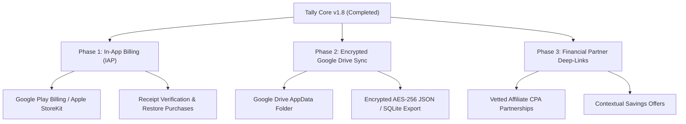

# Tally — 2026 Industry Best Practices, Monetization Blueprint & Competitive Benchmark

> **Last Updated:** September 2026  
> **Target App:** Tally (Offline-First Personal Finance, Budgeting & Expense Tracker)  
> **Benchmarks:** Monarch Money, Copilot Money, YNAB (You Need A Budget), Splitwise, Empower, NerdWallet

---

## 1. Executive Summary: The Modern Fintech Paradigm

Leading personal finance apps in 2026 have shifted decisively away from traditional "infinite freemium" and intrusive ad-network banners toward **high-trust hybrid models**:
1. **Value-Based Feature Gating ("Tracking" vs. "Planning")**: Core manual tracking is free to maximize top-of-funnel acquisition, while predictive intelligence, velocity run-rates, and deep customizations are gated behind Pro.
2. **Native Financial Partner Cards Over Programmatic Ads**: Banner ads from general programmatic ad networks (e.g. random popups, low-trust games) severely damage fintech credibility. Leading apps (NerdWallet, Empower, Splitwise) instead use theme-matched, curated partner cards (HYSA yields, cashback cards, investment vaults) that provide real utility and earn high CPA commissions ($25–$120+).
3. **Decoupled "Remove Ads" vs. "Full Pro"**: Offering a standalone $1.99 one-time ad removal alongside a $4.99 Pro analytical tier captures both price-sensitive casual users and high-LTV power users.
4. **Local-First SQLite with Cloud Vault Backups**: Local database remains the instant, non-blocking single source of truth, with Google Authentication providing secure identity binding and frictionless Google Drive / Cloud Sync.
5. **Progressive Disclosure Onboarding**: Replacing forced, multi-step coachmarks with contextual "just-in-time" inline hints, pre-filled smart suggestions, and dismissible micro-tours.

---

## 2. Competitive Benchmark: How the Leaders Operate

| App | Primary Monetization | Free vs. Gated Boundary | In-App Ads Strategy | Onboarding / Auth Model |
| :--- | :--- | :--- | :--- | :--- |
| **Copilot Money** | Subscription ($13/mo or $95/yr) | **Activation Gate**: First 30 transactions free to train AI before requiring a trial/subscription. | **Zero ads**. Pure luxury, privacy-first brand positioning. | Apple/Google ID binding; interactive intelligence setup. |
| **Monarch Money** | Subscription ($14.99/mo or $99/yr) | **Planning Gate**: Basic transaction logging vs. multi-year forecasting, investments, and household sharing. | **Zero ads**. High subscription fee covers Plaid connection costs. | Progressive goal setup; collaborative invites. |
| **YNAB** | Subscription ($14.99/mo or $109/yr) | **Methodology / Trial**: 34-day full-access trial; requires commitment to zero-based budgeting habit. | **Zero ads**. Focuses entirely on educational content and habit formation. | Hands-on transaction assignment tour; "Give every dollar a job". |
| **Splitwise** | Freemium + Splitwise Pro ($3.99/mo) | **Utility Gate**: Core splitting is free; receipt scanning, currency conversion, and charts are Pro. | **Native display ads** in expense feed; offers dedicated "Remove Ads" upgrade. | Quick social login (Google/Apple/Email); immediate group creation. |
| **NerdWallet / Empower** | Free with Affiliate / Partner Cards | Free personal financial management tools (net worth, cash flow). | **Curated Affiliate Cards**: HYSA rates, refinancing, credit cards ($30–$150 CPA). | High-trust financial dashboard; contextual recommendation cards. |
| **Tally (Our App)** | **Hybrid Freemium + Native Banners** | **Tracking Free / Intelligence Pro**: Core tracking, accounts, and 3 base themes are free. Insights, Theme Studio, and launcher icons are Pro ($4.99). | **Theme-matched native partner banners** (HYSA, Vault, Multi-Currency). Dedicated $1.99 Ad-Free pass. | Google Auth database binding; optional BiometricPrompt; dismissible 1-time guided tours. |

---

## 3. Deep-Dive: The 5 Pillars of Modern Fintech Best Practices

### Pillar 1: Feature Gating ("Passive Tracking" vs. "Active Planning")
- **The Core Law**: Never charge for basic manual data entry. If a user feels they must pay just to log a coffee expense, abandonment exceeds 80%.
- **What Free Users Receive**:
  - Unlimited manual transaction logging.
  - Auto-category population and custom dates.
  - Multi-account balance tracking (Cash, Bank, Savings, Credit).
  - High-craft curated default themes (*Ledger*, *Paper*, *Ink*).
- **What Pro Users Pay For ($4.99 / Pro Tier)**:
  - **Predictive Velocity & Run-Rate Forecasting**: 30-day projected balance, burn-rate velocity indicators, and savings trajectory.
  - **Bespoke Theme Studio**: Custom RGB/HSV color sliders, custom accents, surface tones, and custom text luminance.
  - **Dynamic Launcher App Icons**: Switching system home-screen icons dynamically.
  - **Advanced Financial Exports**: Formatted PDF statements and CSV exports for tax/accountants.

### Pillar 2: Advertising Architecture (Trust vs. Revenue)
- **The Pitfall of Programmatic Display**: Flashing 320x50 AdMob banners featuring games or clickbait degrade financial trust instantly. Users perceive the app as insecure or cheap.
- **The Best Practice Solution**:
  - **Native Visual Harmony**: Ads must inherit the current active palette (`AppTheme.primary`, `surface`, `cardBorder`), rounded corners, and typography.
  - **Relevant Financial Utility**: Promote high-yield cash vaults (5.2% APY), expense categorization tools, or multi-currency wallets.
  - **Clear Disclosure**: Always display a clean, muted `"Ad"` or `"Partner Offer"` tag.
  - **Unobtrusive Frequency**: Strict limit of 1 banner per view (Dashboard, Accounts, All Transactions). Never use interstitials or popups.
  - **Standalone Ad-Free Microtransaction**: Users who dislike ads but don't need Pro analytics can pay a low one-time fee ($1.99) to banish all banners forever.

### Pillar 3: Authentication & Cloud Sync ("Local-First" Architecture)
- **Local SQLite as the Single Source of Truth**:
  - App opens instantly (0ms network latency).
  - All CRUD operations write immediately to local SQLite.
  - Users can track expenses offline on planes, underground subways, or in low-coverage areas without spinning loaders.
- **Google Account Binding**:
  - Solves data persistence: All local SQLite records (transactions, accounts, budgets, goals) are bound to `user_id = googleUser.email`.
  - Enables painless multi-account switching on shared family tablets or devices.
  - Prepares the app for Google Drive AppData folder encrypted backup without requiring costly centralized server infrastructure.

### Pillar 4: Progressive Disclosure Onboarding
- **The Problem with 7-Step Forced Tours**: Industry analytics show that >65% of users immediately tap "Skip" on multi-step coachmark overlays.
- **The Modern Approach**:
  - **Contextual Inline Hints**: Placeholder text explaining smart features (e.g., *"Optional — auto-fills with category if empty"* in transaction title fields).
  - **Proactive Micro-Prompts**: Suggesting Biometric Fingerprint/Face ID setup upon successful login with a 1-tap enable.
  - **Segmented Screen Tours**: 2-step targeted walk-through only shown once when entering a complex new module (e.g., Accounts Screen account type management).

### Pillar 5: Security & Biometrics
- **Hardware-Backed Biometrics**: Using Android `BiometricPrompt` and iOS `LocalAuthentication` with strong biometric flags.
- **Graceful Fallback**: Automatically falling back to device PIN/Pattern/Password if biometric sensors are temporarily unavailable or disabled.
- **Zero Financial Data Transmission**: Transaction details remain encrypted locally on the device unless explicitly synced to the user's private Google Drive.

---

## 4. Strategic Next-Level Roadmap for Tally

### Phase 1: Native In-App Billing (IAP) Integration
- Connect `MonetizationService` to `in_app_purchase` or `purchases_flutter` (RevenueCat) for production Google Play / iOS App Store billing.
- Maintain existing Promo Code bypass (`PROVIP`, `NOADS`) for test builds, reviewer accounts, and VIP promotions.

### Phase 2: Encrypted Google Drive Cloud Vault
- Since Google Sign-In is already integrated, request the scoped `drive.appdata` permission.
- Store an encrypted, versioned backup of the local SQLite database in the user's personal Google Drive storage space.
- Zero server hosting costs, zero liability for storing user financial data on third-party servers, and 100% GDPR/privacy compliance.

### Phase 3: Contextual Affiliate Deep-Links
- Transform placeholder partner banners into active, vetted affiliate links (e.g., Wise for multi-currency transfers, Ally/Marcus for High-Yield Savings).
- Provide tangible financial benefits to users while yielding $25–$80 per verified conversion.
